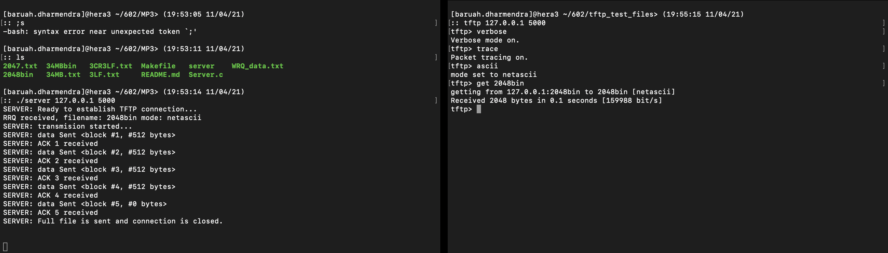
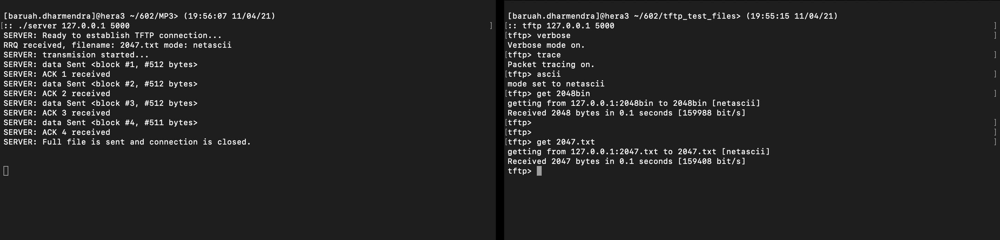
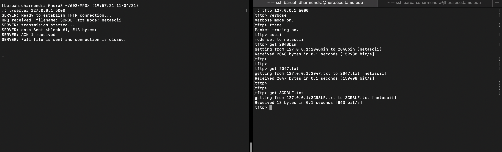
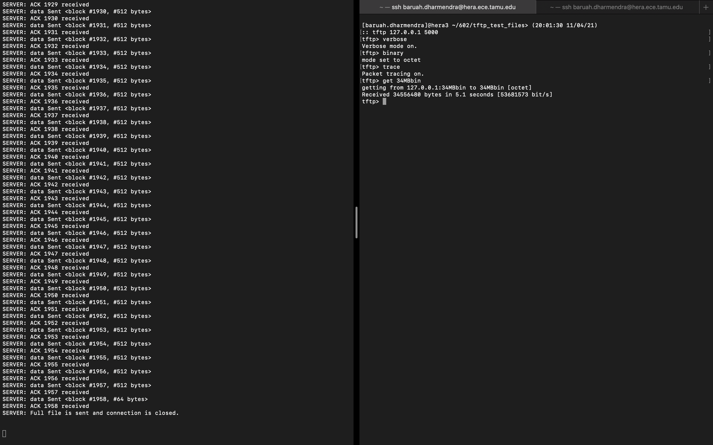
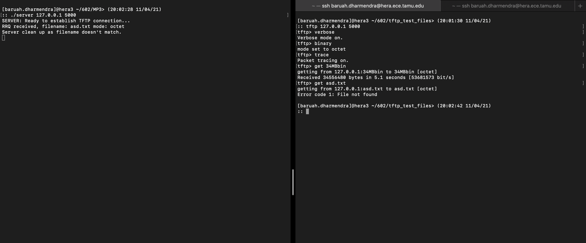
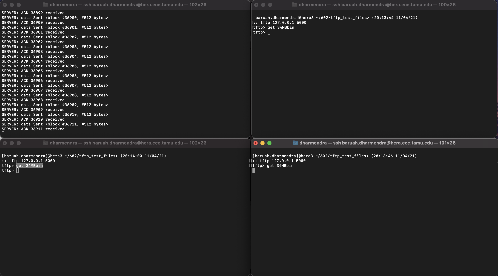
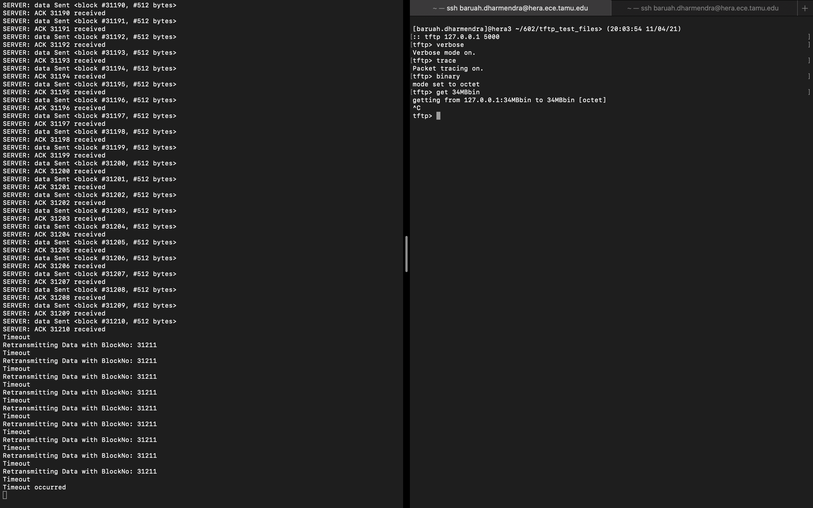
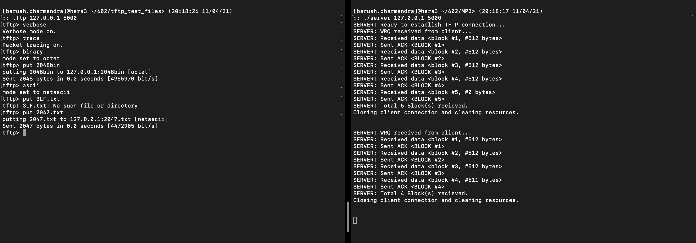

# Trivial File Transfer Protocol (TFTP) server

## Purpose:

This Project is developed as a part of Machine Problem 3 of Computer Networks and Communication course. It is performed as a team of two where we are supposed to implement Trivial File Transfer Protocol (TFTP) server.

---

## Implementation:

 The Trivial File Transfer Protocol (TFTP) server performs the following implementation:
1.  Start the server first with the command line: server IPAdr Port.
2.  Start the client second with a command line: tftp, than IPAdr Port.
3.  A client use get to receives a file using UDP server.
4.  Server and Clients  may  exit  unceremoniously  at  any time during the transmission. 
5.  The  server receive an error message if tring to transfer a file that does not exist and that the server cleans up and the child process exits.

---

## Running

### Installation: 

Clone this repository
```
git@github.tamu.edu:baruah-dharmendra/ECEN602_Team04.git
```

### Building: 

For this we will need standard C compiler installed in the machine in which the program is run. To build it can be directly done from the make file or individually by compiling the server client.

For building without the make file:

Build the server: ``` gcc -o Server server.c ```

For building with the makefile we can just use the command 
```
make
```
### Execution:

Open the terminal window and run:     ``` ./Server 127.0.0.1 5000 ```

If the server response following should be visible in the terminal.
```
SERVER: Ready to establish TFTP connection...

```

## Test cases


(1) transfer a binary file of 2048 bytes and check that it matches the source file, 



(2) transfer a binary file of 2047 bytes and check that it matches the source file, 



(3) transfer a netascii file that includes two CR’s and check that the resulting file matches the input file, 



(4) transfer a binary file of 34 MB and see if block number wrap-around works, 



(5) check that you receive an error message if you try to transfer a file that does not exist and that your server cleans up and the child process exits, 



(6) Connect to the TFTP server with three clients simultaneously and test that the transfers work correctly (you will probably need a big file to have them all running at the same time), 



(7) terminate the TFTP client in the middle of a transfer and see if your TFTP server recognizes after 10 timeouts that the client is no longer there (you will need a big file), and 



(8) separate test cases for the bonus feature (see the Bonus Feature section).


---
## Team

@dharmendrabaruah
@yehtungchi

---
## Effort

The entire project was completed with equal efforts from either member of the team maintaining synergy. It was carried out in the university library, where both of the members were responsible for the analysis, coding, debugging, testing and documentation of the server client application.

---
